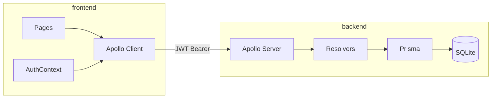

# Plano: Financy (PRD + Figma + Fluxograma)

## Contexto

- Repositório local **vazio** (só `.git`).
- Spec: [PRD_Financy.pdf](c:\Users\david\Downloads\PRD_Financy.pdf), [flowchart_financy.md](c:\Users\david\Downloads\flowchart_financy.md).
- UI: [Figma Financy Community](https://www.figma.com/design/KY1pizQ8CH6aX66Yi5a5ak/Financy--Community-?node-id=3-376) — frames: Login, Cadastro, Dashboard, Transações, Categorias, Perfil + modais de transação/categoria.

## Decisões técnicas (fixadas)

| Camada     | Escolha                                                                                                                                  |
| ---------- | ---------------------------------------------------------------------------------------------------------------------------------------- |
| Backend    | Express + Apollo Server 4 + GraphQL + Prisma + SQLite                                                                                    |
| Auth       | JWT (`Bearer`), bcrypt, `userId` só do token (nunca do client)                                                                           |
| Cadastro   | Auto-login (retorna `AuthPayload` e salva token) — alinhado ao fluxograma                                                                |
| Lembrar-me | `localStorage` se marcado; senão `sessionStorage`                                                                                        |
| Frontend   | Vite + React + TS + React Router + Apollo Client + RHF + Zod                                                                             |
| UI         | Tailwind + componentes no estilo do Figma (Inter, verde `#1f6f43`, bg `#f8f9fa`) + Lucide (ícones do design: `wallet`, `utensils`, etc.) |
| Escopo     | P0 + P1; **sem** P2 (avatar upload, recover password real, etc.)                                                                         |

## Arquitetura



## Estrutura do repositório

```
/
├── backend/
│   ├── prisma/schema.prisma
│   ├── src/{auth,users,transactions,categories,dashboard,graphql,shared}/
│   ├── .env.example
│   └── package.json
├── frontend/
│   ├── src/{pages,components,layouts,graphql,hooks,contexts,schemas,utils}/
│   ├── .env.example
│   └── package.json
└── README.md
```

## Etapa 1 — Fundação

- Criar `backend/` e `frontend/` com TypeScript.
- Prisma schema (User, Category, Transaction + enum `INCOME`/`EXPENSE`, `Decimal` em `amount`, indexes em `userId`).
- Migration inicial + `.env.example` (`JWT_SECRET`, `DATABASE_URL=file:./dev.db`, `PORT`, `FRONTEND_URL`).
- Front: Vite, Tailwind, tokens CSS (`--primary: #1f6f43`, neutrals do Figma), logo exportada do Figma (baixar assets MCP e versionar em `frontend/src/assets`).
- README raiz: como subir API (`localhost:3333/graphql`) e front.

## Etapa 2 — Backend GraphQL

**Schema Prisma (essência do PRD §11):** User / Category / Transaction com relações 1-N e `onDelete` adequado (bloquear delete de categoria em uso na regra de negócio, não cascade nas transactions).

**Contexto GraphQL:** extrair JWT do header, anexar `user` ou `null`.

**Queries:** `me`, `dashboard`, `transactions(filters, pagination)`, `transaction(id)`, `categories`, `category(id)`  
**Mutations:** `register`, `login`, `updateProfile`, CRUD transactions/categories

**Regras críticas:**

- Isolamento por `userId` do contexto em toda query/mutation.
- Filtros/paginação **no servidor** (10/página, `totalCount`, ordenação `date desc`).
- `dashboard`: saldo = Σ income − Σ expense; receitas/despesas do mês corrente; 5 recentes; `categorySummaries`.
- `deleteCategory`: se `_count.transactions > 0` → erro `CATEGORY_IN_USE`.
- Códigos GraphQL: `UNAUTHENTICATED`, `FORBIDDEN`, `BAD_USER_INPUT`, `NOT_FOUND`, `CONFLICT`, `CATEGORY_IN_USE`.
- CORS com `FRONTEND_URL`; senha nunca no payload.

## Etapa 3 — Frontend: auth e shell

Rotas:

- Públicas: `/login`, `/register`
- Protegidas (layout com Navbar Figma): `/`, `/transactions`, `/categories`, `/profile`

Implementar:

- `AuthContext` + link Apollo com token.
- Login/Cadastro fiéis aos frames `3101:353` / `3103:1915` (card central, “Lembrar-me”, link visual “Recuperar senha” sem fluxo real).
- Redirect: autenticado → dashboard; sem token → login; token inválido → mensagem de sessão expirada + logout.

## Etapa 4 — Páginas e modais (Figma)

Referência visual principal: Dashboard `3103:1987` (navbar, 3 cards, recentes + categorias).

| Página          | Frame Figma | Comportamento                                                                       |
| --------------- | ----------- | ----------------------------------------------------------------------------------- |
| Dashboard       | `3103:1987` | Query `dashboard`; links Ver todas / Gerenciar; CTA nova transação                  |
| Transações      | `3104:362`  | Filtros (descrição, tipo, categoria, período) + tabela + paginação + editar/excluir |
| Categorias      | `3104:2028` | Indicadores + grid de cards (ícone/cor/ações)                                       |
| Perfil          | `3104:2925` | Iniciais, editar nome, e-mail readonly, logout                                      |
| Modal transação | `3107:4295` | Toggle Despesa/Receita; create/edit                                                 |
| Modal categoria | `3107:4607` | Título, descrição, seletor ícone + cor                                              |

Estados UX (PRD §16): loading/skeleton, empty, erro, confirmação de exclusão, botões disabled ao salvar. Formatação BRL e datas `DD/MM/AAAA`.

Após mutations: refetch/cache update das queries afetadas (`dashboard`, `transactions`, `categories`).

## Etapa 5 — Qualidade e entrega

- Validar checklist §18 (auth, isolamento, CRUD, dashboard, stack).
- Sem mocks nas telas finais.
- Migrations commitadas; `.env.example` atualizados; README com instalação do zero.
- Responsividade: tabela com scroll horizontal em mobile (RNF02).

## Ordem de execução na implementação

1. Scaffold + Prisma + Apollo base
2. Auth (register/login/me/JWT)
3. Categories CRUD API + página/modal
4. Transactions CRUD + filtros/paginação + modal
5. Dashboard query + página
6. Perfil + logout + polish visual vs Figma
7. README + smoke test local

## Fora de escopo (P2)

Upload de avatar, recuperação real de senha, refresh token, gráficos, deploy, e2e ampliados — não implementar nesta entrega.
