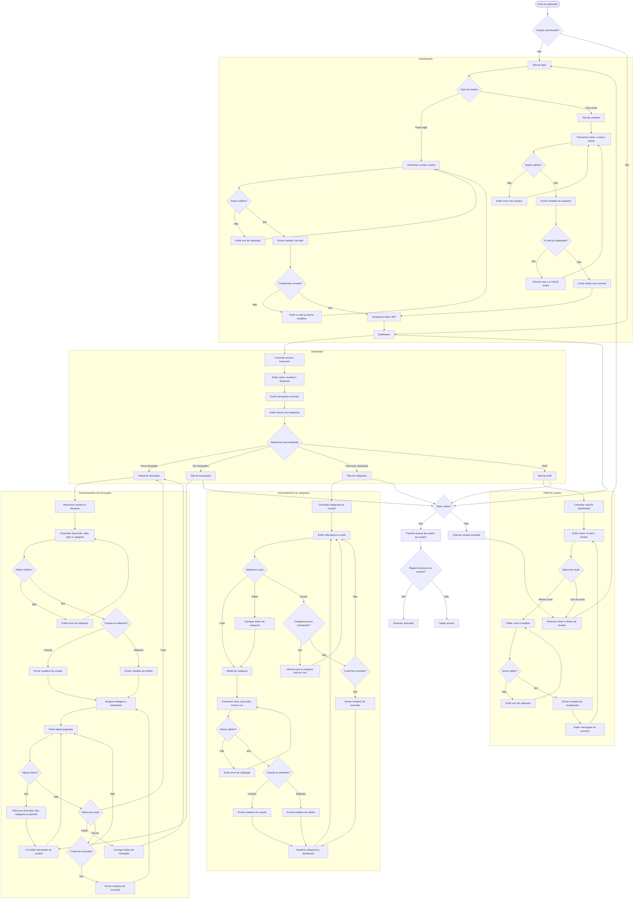

# Flowchart — Financy

```mermaid
flowchart TD
    START([Início da aplicação]) --> CHECK_AUTH{Usuário autenticado?}

    CHECK_AUTH -- Não --> LOGIN_PAGE[Tela de login]
    CHECK_AUTH -- Sim --> DASHBOARD[Dashboard]

    %% AUTENTICAÇÃO
    subgraph AUTH["Autenticação"]
        LOGIN_PAGE --> LOGIN_ACTION{Ação do usuário}

        LOGIN_ACTION -- Fazer login --> LOGIN_FORM[Preencher e-mail e senha]
        LOGIN_FORM --> VALIDATE_LOGIN{Dados válidos?}

        VALIDATE_LOGIN -- Não --> LOGIN_ERROR[Exibir erro de validação]
        LOGIN_ERROR --> LOGIN_FORM

        VALIDATE_LOGIN -- Sim --> AUTH_REQUEST[Enviar mutation de login]
        AUTH_REQUEST --> AUTH_SUCCESS{Credenciais corretas?}

        AUTH_SUCCESS -- Não --> INVALID_CREDENTIALS[Exibir e-mail ou senha inválidos]
        INVALID_CREDENTIALS --> LOGIN_FORM

        AUTH_SUCCESS -- Sim --> SAVE_TOKEN[Armazenar token JWT]
        SAVE_TOKEN --> DASHBOARD

        LOGIN_ACTION -- Criar conta --> REGISTER_PAGE[Tela de cadastro]
        REGISTER_PAGE --> REGISTER_FORM[Preencher nome, e-mail e senha]
        REGISTER_FORM --> VALIDATE_REGISTER{Dados válidos?}

        VALIDATE_REGISTER -- Não --> REGISTER_ERROR[Exibir erros nos campos]
        REGISTER_ERROR --> REGISTER_FORM

        VALIDATE_REGISTER -- Sim --> REGISTER_REQUEST[Enviar mutation de cadastro]
        REGISTER_REQUEST --> EMAIL_EXISTS{E-mail já cadastrado?}

        EMAIL_EXISTS -- Sim --> DUPLICATE_EMAIL[Informar que o e-mail já existe]
        DUPLICATE_EMAIL --> REGISTER_FORM

        EMAIL_EXISTS -- Não --> ACCOUNT_CREATED[Conta criada com sucesso]
        ACCOUNT_CREATED --> SAVE_TOKEN
    end

    %% DASHBOARD
    subgraph HOME["Dashboard"]
        DASHBOARD --> LOAD_DASHBOARD[Consultar resumo financeiro]
        LOAD_DASHBOARD --> DISPLAY_SUMMARY[Exibir saldo, receitas e despesas]
        DISPLAY_SUMMARY --> DISPLAY_RECENTS[Exibir transações recentes]
        DISPLAY_RECENTS --> DISPLAY_CATEGORIES[Exibir resumo de categorias]

        DISPLAY_CATEGORIES --> MAIN_ACTION{Selecionar funcionalidade}

        MAIN_ACTION -- Nova transação --> TRANSACTION_MODAL
        MAIN_ACTION -- Ver transações --> TRANSACTIONS_PAGE
        MAIN_ACTION -- Gerenciar categorias --> CATEGORIES_PAGE
        MAIN_ACTION -- Perfil --> PROFILE_PAGE
    end

    %% TRANSAÇÕES
    subgraph TRANSACTIONS["Gerenciamento de transações"]
        TRANSACTIONS_PAGE[Tela de transações] --> LOAD_TRANSACTIONS[Consultar transações do usuário]
        LOAD_TRANSACTIONS --> SHOW_TRANSACTIONS[Exibir tabela paginada]

        SHOW_TRANSACTIONS --> FILTER_ACTION{Aplicar filtros?}
        FILTER_ACTION -- Sim --> APPLY_FILTERS[Filtrar por descrição, tipo, categoria ou período]
        APPLY_FILTERS --> LOAD_TRANSACTIONS
        FILTER_ACTION -- Não --> TRANSACTION_ACTION{Selecionar ação}

        TRANSACTION_ACTION -- Criar --> TRANSACTION_MODAL[Modal de transação]
        TRANSACTION_ACTION -- Editar --> LOAD_TRANSACTION[Carregar dados da transação]
        LOAD_TRANSACTION --> TRANSACTION_MODAL
        TRANSACTION_ACTION -- Excluir --> CONFIRM_DELETE_TRANSACTION{Confirmar exclusão?}

        CONFIRM_DELETE_TRANSACTION -- Não --> SHOW_TRANSACTIONS
        CONFIRM_DELETE_TRANSACTION -- Sim --> DELETE_TRANSACTION[Enviar mutation de exclusão]
        DELETE_TRANSACTION --> UPDATE_TRANSACTION_DATA[Atualizar listagem e dashboard]
        UPDATE_TRANSACTION_DATA --> SHOW_TRANSACTIONS

        TRANSACTION_MODAL --> SELECT_TRANSACTION_TYPE[Selecionar receita ou despesa]
        SELECT_TRANSACTION_TYPE --> FILL_TRANSACTION[Preencher descrição, data, valor e categoria]
        FILL_TRANSACTION --> VALIDATE_TRANSACTION{Dados válidos?}

        VALIDATE_TRANSACTION -- Não --> TRANSACTION_ERROR[Exibir erros de validação]
        TRANSACTION_ERROR --> FILL_TRANSACTION

        VALIDATE_TRANSACTION -- Sim --> SAVE_TRANSACTION{Criando ou editando?}
        SAVE_TRANSACTION -- Criando --> CREATE_TRANSACTION[Enviar mutation de criação]
        SAVE_TRANSACTION -- Editando --> UPDATE_TRANSACTION[Enviar mutation de edição]

        CREATE_TRANSACTION --> UPDATE_TRANSACTION_DATA
        UPDATE_TRANSACTION --> UPDATE_TRANSACTION_DATA
    end

    %% CATEGORIAS
    subgraph CATEGORIES["Gerenciamento de categorias"]
        CATEGORIES_PAGE[Tela de categorias] --> LOAD_CATEGORIES[Consultar categorias do usuário]
        LOAD_CATEGORIES --> SHOW_CATEGORIES[Exibir indicadores e cards]

        SHOW_CATEGORIES --> CATEGORY_ACTION{Selecionar ação}

        CATEGORY_ACTION -- Criar --> CATEGORY_MODAL[Modal de categoria]
        CATEGORY_ACTION -- Editar --> LOAD_CATEGORY[Carregar dados da categoria]
        LOAD_CATEGORY --> CATEGORY_MODAL
        CATEGORY_ACTION -- Excluir --> CATEGORY_IN_USE{Categoria possui transações?}

        CATEGORY_IN_USE -- Sim --> BLOCK_CATEGORY_DELETE[Informar que a categoria está em uso]
        BLOCK_CATEGORY_DELETE --> SHOW_CATEGORIES

        CATEGORY_IN_USE -- Não --> CONFIRM_DELETE_CATEGORY{Confirmar exclusão?}
        CONFIRM_DELETE_CATEGORY -- Não --> SHOW_CATEGORIES
        CONFIRM_DELETE_CATEGORY -- Sim --> DELETE_CATEGORY[Enviar mutation de exclusão]
        DELETE_CATEGORY --> REFRESH_CATEGORIES[Atualizar categorias e dashboard]
        REFRESH_CATEGORIES --> SHOW_CATEGORIES

        CATEGORY_MODAL --> FILL_CATEGORY[Preencher título, descrição, ícone e cor]
        FILL_CATEGORY --> VALIDATE_CATEGORY{Dados válidos?}

        VALIDATE_CATEGORY -- Não --> CATEGORY_ERROR[Exibir erros de validação]
        CATEGORY_ERROR --> FILL_CATEGORY

        VALIDATE_CATEGORY -- Sim --> SAVE_CATEGORY{Criando ou editando?}
        SAVE_CATEGORY -- Criando --> CREATE_CATEGORY[Enviar mutation de criação]
        SAVE_CATEGORY -- Editando --> UPDATE_CATEGORY[Enviar mutation de edição]

        CREATE_CATEGORY --> REFRESH_CATEGORIES
        UPDATE_CATEGORY --> REFRESH_CATEGORIES
    end

    %% PERFIL
    subgraph PROFILE["Perfil do usuário"]
        PROFILE_PAGE[Tela de perfil] --> LOAD_PROFILE[Consultar usuário autenticado]
        LOAD_PROFILE --> SHOW_PROFILE[Exibir nome, e-mail e iniciais]

        SHOW_PROFILE --> PROFILE_ACTION{Selecionar ação}

        PROFILE_ACTION -- Alterar nome --> EDIT_NAME[Editar nome completo]
        EDIT_NAME --> VALIDATE_NAME{Nome válido?}

        VALIDATE_NAME -- Não --> NAME_ERROR[Exibir erro de validação]
        NAME_ERROR --> EDIT_NAME

        VALIDATE_NAME -- Sim --> UPDATE_PROFILE[Enviar mutation de atualização]
        UPDATE_PROFILE --> PROFILE_UPDATED[Exibir mensagem de sucesso]
        PROFILE_UPDATED --> SHOW_PROFILE

        PROFILE_ACTION -- Sair da conta --> LOGOUT[Remover token e dados da sessão]
        LOGOUT --> LOGIN_PAGE
    end

    %% SEGURANÇA
    DASHBOARD --> TOKEN_CHECK{Token válido?}
    TRANSACTIONS_PAGE --> TOKEN_CHECK
    CATEGORIES_PAGE --> TOKEN_CHECK
    PROFILE_PAGE --> TOKEN_CHECK

    TOKEN_CHECK -- Sim --> AUTHORIZED[Permitir acesso aos dados do usuário]
    TOKEN_CHECK -- Não --> SESSION_EXPIRED[Informar sessão expirada]
    SESSION_EXPIRED --> LOGOUT

    AUTHORIZED --> USER_OWNERSHIP{Registro pertence ao usuário?}
    USER_OWNERSHIP -- Sim --> ALLOW_OPERATION[Executar operação]
    USER_OWNERSHIP -- Não --> ACCESS_DENIED[Negar acesso]

```
